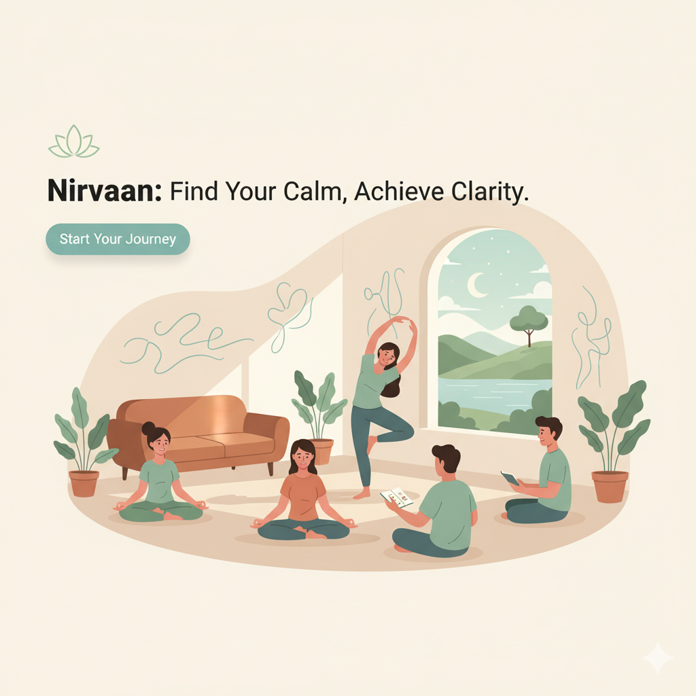

# 🎓 Nirvaan

[](https://nextjs.org/)
[](https://www.mongodb.com/)
[](LICENSE)

> A modern platform connecting students with counsellors and educational institutions for better academic guidance and support.



## ✨ Features

- 🔐 **Secure Authentication** - Robust user authentication system
- 💬 **Interactive Chat** - Real-time communication between students and counsellors
- 🏛️ **Institution Forums** - Dedicated discussion spaces for educational institutions
- 📋 **Screening Process** - Comprehensive student assessment system
- 🌐 **Resource Center** - Educational resources and materials
- 👥 **Counsellor Network** - Connect with professional academic counsellors
- 🎯 **Profile Management** - Detailed user and institution profiles

## 🚀 Getting Started

### Prerequisites

- Node.js 16.x or later
- MongoDB database
- npm or yarn package manager

### Installation

1. Clone the repository
```bash
git clone https://github.com/harshchill/nirvaan.git
cd nirvaan
```

2. Install dependencies
```bash
npm install
# or
yarn install
```

3. Set up environment variables
```bash
# Create a .env.local file and add the following
MONGODB_URI=your_mongodb_connection_string
NEXTAUTH_SECRET=your_auth_secret
NEXTAUTH_URL=http://localhost:3000
```

4. Start the development server
```bash
npm run dev
# or
yarn dev
```

Visit [http://localhost:3000](http://localhost:3000) to see the application.

## 🏗️ Project Structure

```
nirvaan/
├── app/                    # Next.js 13 app directory
│   ├── api/               # API routes
│   ├── chat/             # Chat functionality
│   ├── Components/       # Reusable components
│   ├── counsellor/      # Counsellor pages
│   └── forum/           # Forum functionality
├── lib/                  # Utility functions
├── models/              # MongoDB models
└── public/              # Static assets
```

## 💡 Core Features Explained

### Authentication System
Secure user authentication powered by NextAuth.js, supporting multiple authentication methods and session management.

### Chat System
Real-time communication platform enabling direct interaction between students and counsellors, built with modern streaming technologies.

### Institution Forums
Dedicated spaces for educational institutions to host discussions, share updates, and engage with students.

### Resource Center
Comprehensive collection of educational materials, guides, and resources to support student success.

## 🛠️ Built With

- [Next.js 13](https://nextjs.org/) - React framework
- [MongoDB](https://www.mongodb.com/) - Database
- [NextAuth.js](https://next-auth.js.org/) - Authentication
- [TailwindCSS](https://tailwindcss.com/) - Styling

## 🤝 Contributing

Contributions are welcome! Please feel free to submit a Pull Request.

1. Fork the Project
2. Create your Feature Branch (`git checkout -b feature/AmazingFeature`)
3. Commit your Changes (`git commit -m 'Add some AmazingFeature'`)
4. Push to the Branch (`git push origin feature/AmazingFeature`)
5. Open a Pull Request

## 📝 License

This project is licensed under the MIT License - see the [LICENSE](LICENSE) file for details.

## 🙌 Acknowledgments

- The Next.js team for the amazing framework
- All contributors who have helped shape Nirvaan
- The open-source community for their invaluable tools and libraries

---

<p align="center">Made with ❤️ by the Nirvaan team</p>
